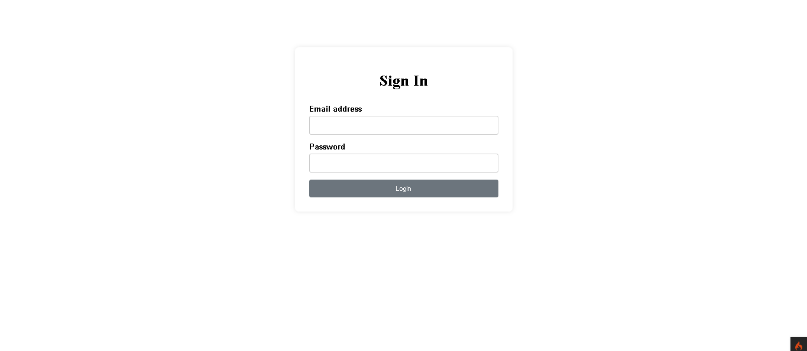

buat database user 
    CREATE TABLE user (
        id INT(11) auto_increment,
        username VARCHAR(200) NOT NULL,
        useremail VARCHAR(200),
        userpassword VARCHAR(200),
    PRIMARY KEY(id)
    );

buat user model beserta controller pada folder masung masing

kemudian buka di browser

lalu kita buat auth filter untuk admin. dengan membuat file baru pada file Auth.php di derektori app/Filters 

    <?php namespace App\Filters;
    use CodeIgniter\HTTP\RequestInterface;
    use CodeIgniter\HTTP\ResponseInterface;
    use CodeIgniter\Filters\FilterInterface;
    use Config\Services;

    class Auth implements FilterInterface
    {
        public function before(RequestInterface $request, $arguments = null)
        {
            // jika user belum login
            $session = \Config\Services::session();
            if(! session()->get('logged_in')){
            // maka redirct ke halaman login
                return redirect()->to('/user/login');
            }
            }
            public function after(RequestInterface $request, ResponseInterface
                $response, $arguments = null)
            {
            // Do something here
        }
    }

tambakan pada app/Config/Filters 

'auth' => \App\Filters\Auth::class,

juga tambahkan "['filter' => 'auth']" pada app/Config/routes
di bagian route group admin

    $routes->group('admin', ['filter' => 'auth'], function($routes) {
        $routes->get('artikel', 'Artikel::admin_index');
        $routes->add('artikel/add', 'Artikel::add');
        $routes->add('artikel/edit/(:any)', 'Artikel::edit/$1');
        $routes->get('artikel/delete/(:any)', 'Artikel::delete/$1');
    });

dan tambahkan pada controller user method logout untuk logut
    public function logout(){
        session()->destroy();
        return redirect()->to('/user/login');
    }